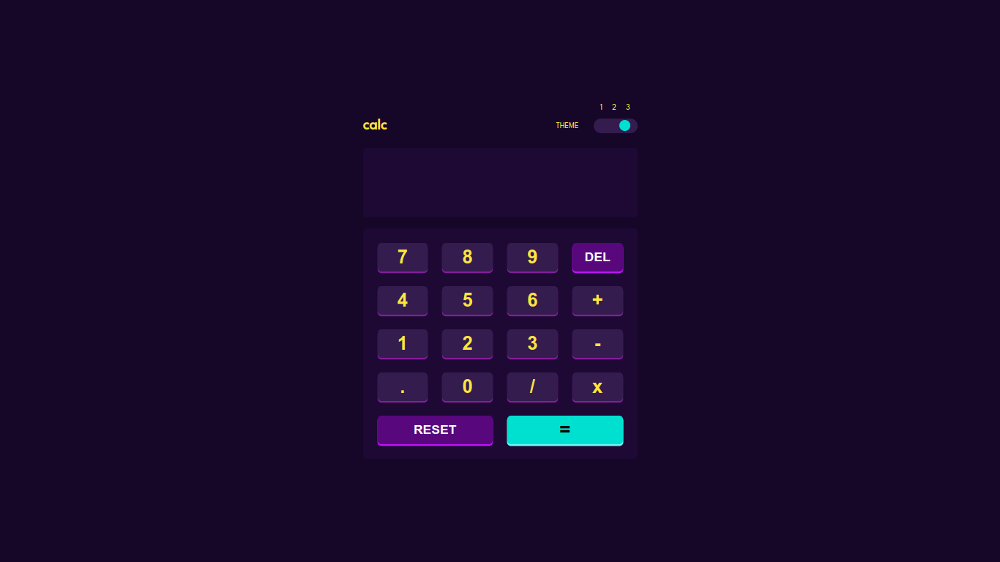

# Frontend Mentor - Calculator app solution

This is a solution to the [Calculator app challenge on Frontend Mentor](https://www.frontendmentor.io/challenges/calculator-app-9lteq5N29). Frontend Mentor challenges help you improve your coding skills by building realistic projects. 

## Table of contents

- [Overview](#overview)
  - [The challenge](#the-challenge)
  - [Screenshot](#screenshot)
  - [Links](#links)
- [My process](#my-process)
  - [Built with](#built-with)
  - [What I learned](#what-i-learned)
  - [Useful resources](#useful-resources)
- [Author](#author)

## Overview

### The challenge

Users should be able to:

- See the size of the elements adjust based on their device's screen size
- Perform mathmatical operations like addition, subtraction, multiplication, and division
- Adjust the color theme based on their preference
- **Bonus**: Have their initial theme preference checked using `prefers-color-scheme` and have any additional changes saved in the browser

### Screenshot

### Links

- Solution URL: [Calculator App](https://www.frontendmentor.io/solutions/calculator-app-U1jSzUlO7C)
- Live Site URL: [Challenge-calculator](https://luciano275.github.io/challenge-calculator/)

## My process

### Built with

- Semantic HTML5 markup
- CSS custom properties
- CSS Grid
- Mobile-first workflow
- [React](https://reactjs.org/) - JS library
- [Redux](https://redux-toolkit.js.org/) - JS library

### What I learned

- While doing this challenge, I learned how to adapt my website to three different themes, that's something I've never done before and I'm glad I did.

### Useful resources

- [Stack Overflow](https://es.stackoverflow.com/) - This helps me whenever I have errors in my code.
- [Developer Mozilla](https://developer.mozilla.org/es/) - This helped me with the css code.

## Author

- Instagram - [@gdgodnemesis](https://www.instagram.com/gdgodnemesis/)

